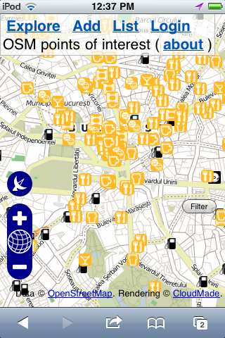

Mapping party!
==============

Adică se întâlnesc un număr de persoane în scopul cartografierii unei
zone. În cazul nostru, zona este centrul vechi, și vrem să marcăm pe
hartă toate cafenelele, restaurantele și barurile.

Cu ocazia asta vrem să testăm site-ul `poi.grep.ro`_ "pe teren", în
special interfața de adăugat locații. Vom pregăti și hărți pe hârtie
pentru marcarea analogică (cu creionul) și digitizare ulterioară, deci
posesia de smartphone este opțională :)

Ne întâlnim la cafeneaua Carada_, sâmbătă 27 august, ora 17:00. Rog dați
un mail_ dacă veniți.

.. _`poi.grep.ro`: http://poi.grep.ro/
.. _Carada: http://metropotam.ro/Unde-iesim/Cafenea-Carada-art4284552409/
.. _mail: mailto:alex@grep.ro

Ce este `poi.grep.ro`?
----------------------

Un catalog de cafenele, baruri, restaurante, teatre și cinema-uri din
București, optimizat pentru identificarea pe hartă a locațiilor. Se
poate căuta după tipul de locație sau după nume. Site-ul este optimizat
pentru browsere mobile și poate folosi senzorul GPS.

Proiectul este non-profit, locațiile și harta sunt preluate din
OpenStreetMap_, și dacă o locație lipsește, poate fi adăugată ușor de
oricine. Locațiile trec printr-o fază de aprobare și sunt contribuite
înapoi în baza de date OpenStreetMap.

.. _OpenStreetMap: http://www.openstreetmap.org/
